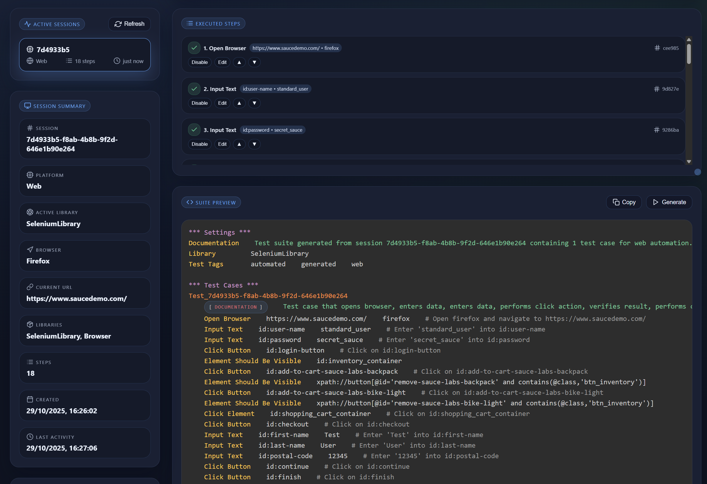

# 🤖 RobotMCP - AI-Powered Test Automation Bridge

[](https://python.org)
[](https://robotframework.org)
[](https://github.com/jlowin/fastmcp)
[](LICENSE)

**Transform natural language into production-ready Robot Framework tests using AI agents and MCP protocol.**

RobotMCP is a comprehensive Model Context Protocol (MCP) server that bridges the gap between human language and Robot Framework automation. It enables AI agents to understand test intentions, execute steps interactively, and generate complete test suites from successful executions.

**📺 Video Tutorial**

[](https://www.youtube.com/watch?v=CBXGEn8jRtU)

**Intro**

https://github.com/user-attachments/assets/ad89064f-cab3-4ae6-a4c4-5e8c241301a1

---

## ✨ Quick Start

### 1️⃣ Install

```bash
pip install rf-mcp
```

### 2️⃣ Add to VS Code (Cline/Claude Desktop)

#### STDIO

```json
{
  "servers": {
    "robotmcp": {
      "type": "stdio",
      "command": "uv",
      "args": ["run", "-m", "robotmcp.server"]
    }
  }
}
```

#### HTTP

Start the MCP server with HTTP transport:

```bash
uv run -m robotmcp.server --transport http --host 127.0.0.1 --port 8000
```

Then configure your AI agent:

```json
{
  "servers": {
    "robotmcp": {
      "type": "http",
      "url": "http://localhost:8000/mcp"
    }
  }
}
```

### 3️⃣ Start Testing with AI

```
Use #robotmcp to create a TestSuite and execute it step wise.
Create a test for https://www.saucedemo.com/ that:
- Logs in to https://www.saucedemo.com/ with valid credentials
- Adds two items to cart
- Completes checkout process
- Verifies success message

Use Selenium Library.
Execute the test suite stepwise and build the final version afterwards.
```

**That's it!** RobotMCP will guide the AI through the entire testing workflow.

---

## 🛠️ Installation & Setup

https://github.com/user-attachments/assets/8448cb70-6fb3-4f04-9742-a8a8453a9c7f

### Prerequisites

- Python 3.10+
- Robot Framework 7.0+
- FastMCP 2.8+ (compatible with both 2.x and 3.x)

`rf-mcp` comes with minimal dependencies by default. To use specific libraries (e.g., Browser, Selenium, Appium), install the corresponding extras or libraries separately.

### Method 1: UV Installation (Recommended)

```bash
# Install with uv pip wrapper
uv venv   # create a virtual environment
uv pip install rf-mcp

# Feature bundles (install what you need)
uv pip install rf-mcp[web]       # Browser Library + SeleniumLibrary
uv pip install rf-mcp[mobile]    # AppiumLibrary
uv pip install rf-mcp[api]       # RequestsLibrary
uv pip install rf-mcp[database]  # DatabaseLibrary
uv pip install rf-mcp[frontend]  # Django-based web frontend dashboard
uv pip install rf-mcp[all]       # All optional Robot Framework libraries

# Alternatively, add to an existing uv project
uv init
# Add rf-mcp to project dependencies and sync
uv add rf-mcp[all]
uv sync

# Browser Library still needs Playwright browsers
uv run rfbrowser init
```

### Method 2 PyPI Installation

```bash
# Install RobotMCP core (minimal dependencies)
pip install rf-mcp

# Feature bundles (install what you need)
pip install rf-mcp[web]       # Browser Library + SeleniumLibrary
pip install rf-mcp[mobile]    # AppiumLibrary
pip install rf-mcp[api]       # RequestsLibrary
pip install rf-mcp[database]  # DatabaseLibrary
pip install rf-mcp[frontend]  # Django-based web frontend dashboard
pip install rf-mcp[all]       # All optional Robot Framework libraries

# Browser Library still needs Playwright browsers
rfbrowser init
# or
python -m Browser.entry install
```

Prefer installing individual Robot Framework libraries instead?
Just install `rf-mcp` and add your desired libraries manually.

### Method 3: Development Installation

```bash
# Clone repository
git clone https://github.com/manykarim/rf-mcp.git
cd rf-mcp

# Install with uv (recommended)
uv sync
# Include optional extras & dev tooling
uv sync --all-extras --dev

# Or with pip
pip install -e .
```

### Method 4: Docker Installation

RobotMCP provides pre-built Docker images for both headless and VNC-enabled environments.

#### Headless Image (Recommended for CI/CD)

```bash
# Pull from GitHub Container Registry
docker pull ghcr.io/manykarim/rf-mcp:latest

# Run with HTTP transport and frontend
docker run -p 8000:8000 -p 8001:8001 ghcr.io/manykarim/rf-mcp:latest

# Or run interactively with STDIO
docker run -it --rm ghcr.io/manykarim/rf-mcp:latest uv run robotmcp
```

**Included browsers:** Chromium, Firefox ESR, Playwright browsers (Chromium, Firefox, WebKit)

#### VNC Image (For Visual Debugging)

The VNC image includes a full X11 desktop accessible via VNC or noVNC web interface:

```bash
# Pull VNC image
docker pull ghcr.io/manykarim/rf-mcp-vnc:latest

# Run with all ports exposed
docker run -p 8000:8000 -p 8001:8001 -p 5900:5900 -p 6080:6080 ghcr.io/manykarim/rf-mcp-vnc:latest
```

**Access points:**
| Port | Service |
|------|---------|
| 8000 | MCP HTTP transport |
| 8001 | Frontend dashboard |
| 5900 | VNC (use any VNC client) |
| 6080 | noVNC web interface (http://localhost:6080/vnc.html) |

#### Building Docker Images Locally

```bash
# Build headless image
docker build -f docker/Dockerfile -t robotmcp .

# Build VNC image
docker build -f docker/Dockerfile.vnc -t robotmcp-vnc .
```

#### Using Docker with VS Code MCP

**STDIO mode:**
```json
{
  "servers": {
    "robotmcp": {
      "command": "docker",
      "args": ["run", "-i", "--rm", "ghcr.io/manykarim/rf-mcp:latest", "uv", "run", "robotmcp"]
    }
  }
}
```

**HTTP mode (start container first, then connect):**
```json
{
  "servers": {
    "robotmcp": {
      "type": "http",
      "url": "http://localhost:8000/mcp"
    }
  }
}
```

### Playwright/Browsers for UI Tests

- Browser Library: run `rfbrowser init` (downloads Playwright and browsers)

### Hint: When using a venv

If you are using a virtual environment (venv) for your project, I recommend to install the `rf-mcp` package within the same venv. When starting the MCP server, make sure to use the Python interpreter from that venv.

---

## 🔌 Library Plugins

Extend RobotMCP with custom libraries via the plugin system. Two discovery modes are available:

- **Entry points** (`robotmcp.library_plugins`) for packaged plugins.
- **Manifest files** (JSON) under `.robotmcp/plugins/` for workspace overrides.

See the [Library Plugin Authoring Guide](docs/library-plugin-authoring.md) for detailed instructions and explore the sample plugin in [`examples/plugins/sample_plugin`](examples/plugins/sample_plugin/) to get started quickly.

---

## 🖥️ Frontend Dashboard

RobotMCP ships with an optional Django-based dashboard that mirrors active sessions, keywords, and tool activity.



1. **Install frontend extras**
   ```bash
   pip install rf-mcp[frontend]
   ```
2. **Start the MCP server with the frontend enabled**
   ```bash
   uv run -m robotmcp.server --with-frontend
   ```
   - Default URL: <http://127.0.0.1:8001/>
   - Quick toggles: `--frontend-host`, `--frontend-port`, `--frontend-base-path`
   - Environment equivalents: `ROBOTMCP_ENABLE_FRONTEND=1`, `ROBOTMCP_FRONTEND_HOST`, `ROBOTMCP_FRONTEND_PORT`, `ROBOTMCP_FRONTEND_BASE_PATH`, `ROBOTMCP_FRONTEND_DEBUG`
3. **Connect your MCP client** (Cline, Claude Desktop, etc.) to the same server process—the dashboard automatically streams events once the session is active.

To disable the dashboard for a given run, either omit the flag or pass `--without-frontend`.

---

## 📋 Instruction Templates

RobotMCP sends server-level instructions to LLMs via the MCP `initialize` response, guiding them to discover keywords before executing them. This significantly reduces failed tool calls and wasted tokens, especially for smaller LLMs.

### Configuration

Three environment variables control instruction behavior:

| Variable | Values | Default |
|----------|--------|---------|
| `ROBOTMCP_INSTRUCTIONS` | `off` / `default` / `custom` | `default` |
| `ROBOTMCP_INSTRUCTIONS_TEMPLATE` | `minimal` / `standard` / `detailed` / `browser-focused` / `api-focused` | `standard` |
| `ROBOTMCP_INSTRUCTIONS_FILE` | Path to `.txt` or `.md` file | *(none, required when mode=custom)* |

### Built-in Templates

| Template | ~Tokens | Best For |
|----------|---------|----------|
| `minimal` | ~40 | Capable LLMs (Claude Opus, GPT-4) — brief reminder only |
| `standard` | ~400 | Mid-range LLMs (Claude Sonnet, GPT-4o) — balanced workflow guide |
| `detailed` | ~600 | Smaller LLMs (Claude Haiku, GPT-4o-mini) — step-by-step with examples |
| `browser-focused` | ~350 | Web-only testing scenarios |
| `api-focused` | ~300 | API-only testing scenarios |

### Example

```json
{
  "servers": {
    "robotmcp": {
      "type": "stdio",
      "command": "uv",
      "args": ["run", "-m", "robotmcp.server"],
      "env": {
        "ROBOTMCP_INSTRUCTIONS": "default",
        "ROBOTMCP_INSTRUCTIONS_TEMPLATE": "detailed"
      }
    }
  }
}
```

### Custom Instructions

Set `ROBOTMCP_INSTRUCTIONS=custom` and provide a file via `ROBOTMCP_INSTRUCTIONS_FILE`. Custom files support `{available_tools}` placeholder substitution. Allowed extensions: `.txt`, `.md`, `.instruction`, `.instructions`. If the file is missing or fails validation, the server falls back to the `standard` template automatically.

See [docs/INSTRUCTION_TEMPLATES_GUIDE.md](docs/INSTRUCTION_TEMPLATES_GUIDE.md) for the full guide.

---

## 🪝 Debug Attach Bridge

https://github.com/user-attachments/assets/8d87cd6e-c32e-4481-9f37-48b83f69f72f

RobotMCP ships with `robotmcp.attach.McpAttach`, a lightweight Robot Framework library that exposes the live `ExecutionContext` over a localhost HTTP bridge. When you debug a suite from VS Code (RobotCode) or another IDE, the bridge lets RobotMCP reuse the in-process variables, imports, and keyword search order instead of creating a separate context.

### MCP Server Setup

Example configuration with passed environment variables for Debug Bridge

#### Using UV

```json
{
  "servers": {
    "RobotMCP": {
      "type": "stdio",
      "command": "uv",
      "args": ["run", "src/robotmcp/server.py"],
      "env": {
        "ROBOTMCP_ATTACH_HOST": "127.0.0.1",
        "ROBOTMCP_ATTACH_PORT": "7317",
        "ROBOTMCP_ATTACH_TOKEN": "change-me",
        "ROBOTMCP_ATTACH_DEFAULT": "auto"
      }
    }
  }
}
```

#### Using Docker

```json
{
  "servers": {
    "RobotMCP": {
      "command": "docker",
      "args": ["run", "-i", "--rm", "ghcr.io/manykarim/rf-mcp:latest", "uv", "run", "robotmcp"],
      "env": {
        "ROBOTMCP_ATTACH_HOST": "127.0.0.1",
        "ROBOTMCP_ATTACH_PORT": "7317",
        "ROBOTMCP_ATTACH_TOKEN": "change-me",
        "ROBOTMCP_ATTACH_DEFAULT": "auto"
      }
    }
  }
}
```

### Robot Framework setup

Import the library and start the serve loop inside the suite that you are debugging:

```robotframework
*** Settings ***
Library    robotmcp.attach.McpAttach    token=${DEBUG_TOKEN}

*** Variables ***
${DEBUG_TOKEN}    change-me

*** Test Cases ***
Serve From Debugger
    MCP Serve    port=7317    token=${DEBUG_TOKEN}    mode=blocking    poll_ms=100
    [Teardown]    MCP Stop
```

- `MCP Serve    port=7317    token=${TOKEN}    mode=blocking|step    poll_ms=100` — starts the HTTP server (if not running) and processes bridge commands. Use `mode=step` during keyword body execution to process exactly one queued request.
- `MCP Stop` — signals the serve loop to exit (used from the suite or remotely via RobotMCP `attach_stop_bridge`).
- `MCP Process Once` — processes a single pending request and returns immediately; useful when the suite polls between test actions.
- `MCP Start` — alias for `MCP Serve` for backwards compatibility.

The bridge binds to `127.0.0.1` by default and expects clients to send the shared token in the `X-MCP-Token` header.

### Configure RobotMCP to attach

Start `robotmcp.server` with attach routing by providing the bridge connection details via environment variables (token must match the suite):

```bash
export ROBOTMCP_ATTACH_HOST=127.0.0.1
export ROBOTMCP_ATTACH_PORT=7317          # optional, defaults to 7317
export ROBOTMCP_ATTACH_TOKEN=change-me    # optional, defaults to 'change-me'
export ROBOTMCP_ATTACH_DEFAULT=auto       # auto|force|off (auto routes when reachable)
export ROBOTMCP_ATTACH_STRICT=0           # set to 1/true to fail when bridge is unreachable
uv run python -m robotmcp.server
```

When `ROBOTMCP_ATTACH_HOST` is set, `execute_step(..., use_context=true)` and other context-aware tools first try to run inside the live debug session. Use the new MCP tools to manage the bridge from any agent:

- `attach_status` — reports configuration, reachability, and diagnostics from the bridge (`/diagnostics`).
- `attach_stop_bridge` — sends a `/stop` command, which in turn triggers `MCP Stop` in the debugged suite.

---

## 🎪 Example Workflows

### 🌐 Web Application Testing

**Prompt:**

```
Use RobotMCP to create a TestSuite and execute it step wise.
Create a test for https://www.saucedemo.com/ that:
- Logs in to https://www.saucedemo.com/ with valid credentials
- Adds two items to cart
- Completes checkout process
- Verifies success message

Use Selenium Library.
Execute the test suite stepwise and build the final version afterwards.

```

**Result:** Complete Robot Framework test suite with proper locators, assertions, and structure.

### 📱 Mobile App Testing

**Prompt:**

```
Use RobotMCP to create a TestSuite and execute it step wise.
It shall:
- Launch app from tests/appium/SauceLabs.apk
- Perform login flow
- Add products to cart
- Complete purchase

Appium server is running at http://localhost:4723
Execute the test suite stepwise and build the final version afterwards.
```

**Result:** Mobile test suite with AppiumLibrary keywords and device capabilities.

### 🔌 API Testing

**Prompt:**

```
Read the Restful Booker API documentation at https://restful-booker.herokuapp.com.
Use RobotMCP to create a TestSuite and execute it step wise.
It shall:

- Create a new booking
- Authenticate as admin
- Update the booking
- Delete the booking
- Verify each response

Execute the test suite stepwise and build the final version afterwards.
```

**Result:** API test suite using RequestsLibrary with proper error handling.

### 🧪 XML/Database Testing

**Prompt:**

```
Create a xml file with books and authors.
Use RobotMCP to create a TestSuite and execute it step wise.
It shall:
- Parse XML structure
- Validate specific nodes and attributes
- Assert content values
- Check XML schema compliance

Execute the test suite stepwise and build the final version afterwards.
```

**Result:** XML processing test using Robot Framework's XML library.

---

## 🔍 MCP Tools Overview

RobotMCP provides a comprehensive toolset organized by function. Highlights:

### Planning & Orchestration

- `analyze_scenario` – Convert natural language to structured test intent and spawn sessions.
- `recommend_libraries` – Suggest libraries (`mode="direct"`, `"sampling_prompt"`, or `"merge_samples"`). Includes confidence filtering, negation support ("not using Selenium"), and conflict prevention (Browser and SeleniumLibrary are never recommended together).
- `manage_library_plugins` – List, reload, or diagnose library plugins from a single endpoint.

### Session & Execution

- `manage_session` – Initialize sessions, import resources/libraries, set variables, manage multi-test suites, or switch tool profiles via `action`. Key actions include `init`, `import_library`, `set_variable`, `start_test`, `end_test`, `list_tests`, `set_suite_setup`, `set_suite_teardown`, `set_tool_profile`.
- `execute_step` – Execute keywords or `mode="evaluate"` expressions with optional `assign_to` and `timeout_ms`. Includes automatic timeout tuning by keyword type and element pre-validation for faster error feedback.
- `execute_flow` – Build `if`/`for_each`/`try` control structures using RF context-first execution.
- `execute_batch` – Execute multiple keywords in a single MCP call with variable chaining (`${STEP_N}` references), automatic recovery on failure, and configurable failure policies (`stop`, `retry`, `recover`). Reduces N tool round-trips to 1.
- `resume_batch` – Resume a failed batch from its failure point, optionally inserting fix steps before retrying.
- `intent_action` – Library-agnostic intent execution (e.g. `intent="click"`, `target="text=Login"`). Resolves to the correct keyword/locator for the session's active library. Supports 8 intents: `navigate`, `click`, `fill`, `hover`, `select`, `assert_visible`, `extract_text`, `wait_for`.

### Discovery & Documentation

- `find_keywords` – Unified keyword discovery (`strategy="semantic"`, `"pattern"`, `"catalog"`, or `"session"`).
- `get_keyword_info` – Retrieve keyword/library documentation or parse argument signatures (`mode="keyword"|"library"|"session"|"parse"`).

### Observability & Diagnostics

- `get_session_state` – Aggregate session insight (`summary`, `variables`, `page_source`, `application_state`, `validation`, `libraries`, `rf_context`). Supports `detail_level="minimal"|"standard"|"full"` for controlling response verbosity.
- `check_library_availability` – Verify availability/install guidance for specific libraries (always includes `success`).
- `set_library_search_order` – Control keyword resolution precedence.
- `manage_attach` – Inspect or stop the attach bridge.

### Suite Lifecycle

- `build_test_suite` – Generate Robot Framework test files from validated steps. Supports multi-test suites with per-test tags, setup, and teardown.
- `run_test_suite` – Validate (`mode="dry"`) or execute (`mode="full"`) suites.

### Locator Guidance

- `get_locator_guidance` – Consolidated Browser/Selenium/Appium selector guidance with structured output.

---

## 🧠 Small LLM Optimization

RobotMCP includes optimizations for small and medium-sized LLMs (8K-32K context windows) that reduce token overhead and improve tool call accuracy.

### Dynamic Tool Profiles

Control which tools are visible to the LLM based on the workflow phase. Smaller models see fewer, more compact tools:

```
manage_session(action="set_tool_profile", tool_profile="browser_exec")
```

Profiles: `browser_exec`, `api_exec`, `discovery`, `minimal_exec`, `full`. Reduces tool description overhead from ~7,000 to ~1,000 tokens. Can also be set via the `ROBOTMCP_TOOL_PROFILE` environment variable.

### Response Verbosity

Control response detail level to reduce token consumption. Available on most tools via the `detail_level` parameter:

- `minimal` – Essential output only (60-80% token reduction)
- `standard` – Balanced output (default)
- `full` – Complete detailed output

Set a default via `ROBOTMCP_OUTPUT_VERBOSITY=compact|standard|verbose`.

### Intent Action

The `intent_action` tool provides a library-agnostic entry point for common test actions. Instead of requiring the LLM to know library-specific keyword names and locator syntax, it expresses intent:

```
intent_action(intent="click", target="text=Login", session_id="...")
intent_action(intent="fill", target="#username", value="testuser", session_id="...")
```

The server resolves intent + target to the correct keyword and locator format for the session's active library (Browser, SeleniumLibrary, or AppiumLibrary).

#### Navigate Fallback

When `intent_action(intent="navigate")` fails because no browser or page is open, the server automatically opens the browser/page and retries:
- **Browser Library**: executes `New Browser` + `New Page` (or just `New Page` if browser exists)
- **SeleniumLibrary**: executes `Open Browser about:blank chrome`

The response includes `fallback_applied: true` and `fallback_steps` count. Saves 2-4 tool calls per session.

### Batch Execution

The `execute_batch` tool executes multiple keywords in a single MCP call, reducing N round-trips to 1. Steps can reference results from earlier steps via `${STEP_N}` variables:

```
execute_batch(session_id="...", steps=[
    {"keyword": "Go To", "args": ["https://example.com"]},
    {"keyword": "Get Title", "assign_to": "title"},
    {"keyword": "Should Be Equal", "args": ["${STEP_2}", "Example Domain"]}
], on_failure="recover")
```

If a step fails, `resume_batch` lets you insert fix steps and retry from the failure point.

### Strict Mode Hints

When a Browser Library keyword fails because the selector matches multiple elements (Playwright strict mode), the error response includes a hint suggesting `>> nth=0` (zero-based index) or `>> visible=true` selector chains, with concrete examples using the actual keyword name and element count.

### Type-Constrained Parameters

All action/mode/strategy parameters use `Literal` types, producing `enum` constraints in the JSON Schema. This eliminates hallucinated values (e.g., `action="setup"` instead of `action="init"`). All values accept case-insensitive input.

### Automatic Parameter Coercion

Common small LLM mistakes are corrected server-side:
- JSON-stringified arrays (`"[\"Browser\"]"`) are parsed to native arrays
- Comma-separated strings (`"Browser,BuiltIn"`) are split into lists
- Deprecated keywords (`GET`) are mapped to current equivalents (`GET On Session`)

### Instruction Templates

Configurable server-level instructions guide LLMs to follow the "discover-then-act" pattern. Choose a template sized for your LLM's capability — from `minimal` (~40 tokens) for Claude Opus to `detailed` (~600 tokens) for Claude Haiku. See [Instruction Templates](#-instruction-templates) above.

---

## ⚙️ Environment Variables Reference

### Core Configuration

| Variable | Values | Default | Description |
|----------|--------|---------|-------------|
| `ROBOTMCP_INSTRUCTIONS` | `off` / `default` / `custom` | `default` | Instruction mode |
| `ROBOTMCP_INSTRUCTIONS_TEMPLATE` | `minimal` / `standard` / `detailed` / `browser-focused` / `api-focused` | `standard` | Template selection (default mode only) |
| `ROBOTMCP_INSTRUCTIONS_FILE` | File path | *(none)* | Custom instructions file (custom mode only) |
| `ROBOTMCP_TOOL_PROFILE` | `browser_exec` / `api_exec` / `discovery` / `minimal_exec` / `full` | *(auto)* | Default tool profile |
| `ROBOTMCP_OUTPUT_VERBOSITY` | `compact` / `standard` / `verbose` | `standard` | Response detail level |
| `ROBOTMCP_USE_SAMPLING` | `true` / `1` / `yes` | *(disabled)* | Enable LLM-powered scenario analysis |
| `ROBOTMCP_PRE_VALIDATION` | `0` / `1` | `1` | Enable element pre-validation before actions |
| `ROBOTMCP_STARTUP_CLEANUP` | `auto` / `on` / `off` | `auto` | Session cleanup on server start |

### Debug Attach Bridge

| Variable | Values | Default | Description |
|----------|--------|---------|-------------|
| `ROBOTMCP_ATTACH_HOST` | hostname/IP | *(none)* | Attach bridge host (enables attach mode) |
| `ROBOTMCP_ATTACH_PORT` | integer | `7317` | Attach bridge port |
| `ROBOTMCP_ATTACH_TOKEN` | string | `change-me` | Shared auth token |
| `ROBOTMCP_ATTACH_DEFAULT` | `auto` / `force` / `off` | `auto` | Attach routing mode |
| `ROBOTMCP_ATTACH_STRICT` | `0` / `1` | `0` | Fail if bridge unreachable |

### Frontend Dashboard

| Variable | Values | Default | Description |
|----------|--------|---------|-------------|
| `ROBOTMCP_ENABLE_FRONTEND` | `0` / `1` | `0` | Enable dashboard |
| `ROBOTMCP_FRONTEND_HOST` | hostname/IP | `localhost` | Dashboard host |
| `ROBOTMCP_FRONTEND_PORT` | integer | `8001` | Dashboard port |
| `ROBOTMCP_FRONTEND_BASE_PATH` | URL path | `/` | URL base path prefix |
| `ROBOTMCP_FRONTEND_DEBUG` | `0` / `1` | `1` | Django debug mode |

---

## 🤝 Contributing

We welcome contributions! Here's how to get started:

1. **Fork** the repository
2. **Clone** your fork locally
3. **Install** development dependencies: `uv sync`
4. **Create** a feature branch
5. **Add** comprehensive tests for new functionality
6. **Run** tests: `uv run pytest tests/`
7. **Submit** a pull request

## 📝 Changelog

- [v0.30.1](docs/RELEASE_NOTES_v0.30.1.md) – FastMCP 3.x compatibility layer
- [v0.30.0](docs/RELEASE_NOTES_v0.30.0.md) – Small LLM optimization (tool profiles, intent action, response optimization, type constraints)
- [v0.29.0](docs/RELEASE_NOTES_v0.29.0.md) – Instruction templates, multi-test sessions, batch execution, smart timeouts

## 📄 License

Apache 2.0 License - see [LICENSE](LICENSE) file for details.

---

**⭐ Star us on GitHub if RobotMCP helps your test automation journey!**

Made with ❤️ for the Robot Framework and AI automation community.
